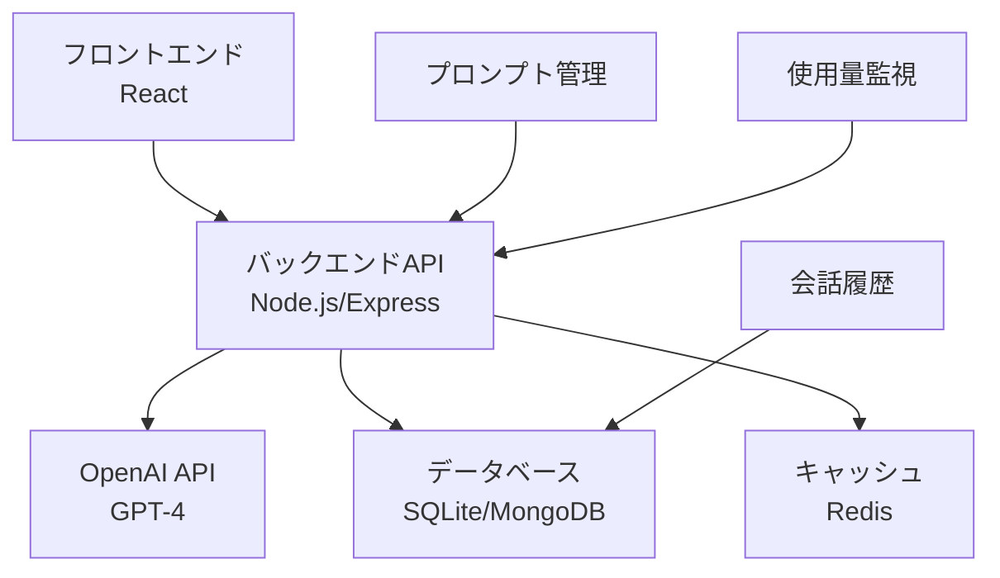

# 🤖 演習6: AIチャットボット
**難易度**: ⭐ 初級（AI統合）  
**推定時間**: 6-8時間  
**AI Engineer #9 + AI Education Assistant #8 担当**

---

## 🎯 学習目標

この演習を通じて以下のAI統合スキルを習得します：

- OpenAI API（GPT-4）の基本的な使用方法
- プロンプトエンジニアリングの基礎
- AI APIのレスポンス処理と エラーハンドリング
- 会話履歴の管理とコンテキスト保持
- ストリーミングレスポンスの実装
- レート制限とコスト管理

---

## 📋 要件定義

### 機能要件

#### 必須機能
1. **基本チャット機能**
   - ユーザーメッセージの送信
   - AIレスポンスの表示
   - 会話履歴の表示

2. **AI統合**
   - OpenAI GPT-4 API連携
   - プロンプトテンプレート機能
   - システムメッセージの設定

3. **会話管理**
   - 新しい会話の開始
   - 会話履歴の保存・読み込み
   - 会話のクリア機能

#### 推奨機能
4. **高度なAI機能**
   - ストリーミングレスポンス
   - 会話のコンテキスト管理
   - AI人格設定（アシスタント、先生、友達など）

5. **ユーザーエクスペリエンス**
   - タイピングインジケーター
   - メッセージの編集・削除
   - お気に入り会話の保存

6. **開発者向け機能**
   - プロンプトデバッグ機能
   - API使用量の表示
   - レスポンス時間の計測

### 非機能要件

- **セキュリティ**: APIキーの適切な管理
- **パフォーマンス**: レスポンス時間3秒以内
- **可用性**: エラー時のフォールバック機能
- **費用効率**: トークン使用量の最適化

---

## 🏗️ システム構成

### アーキテクチャ図



### データモデル

```typescript
interface Message {
  id: string;
  role: 'user' | 'assistant' | 'system';
  content: string;
  timestamp: Date;
  tokens?: number;
}

interface Conversation {
  id: string;
  title: string;
  messages: Message[];
  createdAt: Date;
  updatedAt: Date;
  settings: ConversationSettings;
}

interface ConversationSettings {
  model: string;
  temperature: number;
  maxTokens: number;
  systemPrompt: string;
  personality: string;
}
```

---

## 🗂️ ファイル構成

```
06_ai_chatbot/
├── starter/
│   ├── frontend/
│   │   ├── src/
│   │   │   ├── components/
│   │   │   │   ├── Chat/
│   │   │   │   │   ├── ChatInterface.tsx
│   │   │   │   │   ├── MessageList.tsx
│   │   │   │   │   ├── MessageInput.tsx
│   │   │   │   │   └── TypingIndicator.tsx
│   │   │   │   ├── Settings/
│   │   │   │   │   ├── AISettings.tsx
│   │   │   │   │   └── PromptTemplates.tsx
│   │   │   │   └── Layout/
│   │   │   ├── hooks/
│   │   │   │   ├── useChat.ts
│   │   │   │   ├── useOpenAI.ts
│   │   │   │   └── useLocalStorage.ts
│   │   │   ├── services/
│   │   │   │   ├── api.ts
│   │   │   │   └── openai.ts
│   │   │   └── utils/
│   │   │       ├── prompts.ts
│   │   │       └── tokenCounter.ts
│   │   ├── package.json
│   │   └── .env.example
│   ├── backend/
│   │   ├── src/
│   │   │   ├── routes/
│   │   │   │   ├── chat.js
│   │   │   │   └── conversations.js
│   │   │   ├── services/
│   │   │   │   ├── openai.js
│   │   │   │   └── database.js
│   │   │   ├── middleware/
│   │   │   │   ├── auth.js
│   │   │   │   └── rateLimit.js
│   │   │   └── utils/
│   │   │       ├── prompts.js
│   │   │       └── validation.js
│   │   ├── package.json
│   │   └── .env.example
│   └── shared/
│       ├── prompts/
│       │   ├── assistant.md
│       │   ├── teacher.md
│       │   └── creative.md
│       └── examples/
│           └── conversation-samples.json
├── solution/
│   └── [完成版ファイル群]
├── tests/
│   ├── integration/
│   ├── unit/
│   └── e2e/
└── docs/
    ├── api-documentation.md
    ├── prompt-engineering-guide.md
    └── deployment-guide.md
```

---

## 🚀 実装手順

### Phase 1: 環境セットアップ（1時間）

1. **APIキーの取得**
   ```bash
   # OpenAI APIキーの設定
   # https://platform.openai.com/api-keys
   ```

2. **環境変数の設定**
   ```env
   # .env
   OPENAI_API_KEY=your_openai_api_key_here
   OPENAI_MODEL=gpt-4o-mini
   OPENAI_MAX_TOKENS=1000
   OPENAI_TEMPERATURE=0.7
   ```

3. **依存関係のインストール**
   ```bash
   # バックエンド
   cd backend
   npm install openai express cors dotenv helmet
   
   # フロントエンド  
   cd ../frontend
   npm install react-query axios react-markdown
   ```

### Phase 2: バックエンド実装（2-3時間）

4. **OpenAI サービスの実装**
   ```javascript
   // backend/src/services/openai.js
   import OpenAI from 'openai';
   
   class OpenAIService {
     constructor() {
       this.client = new OpenAI({
         apiKey: process.env.OPENAI_API_KEY,
       });
     }
   
     async createChatCompletion(messages, options = {}) {
       try {
         const response = await this.client.chat.completions.create({
           model: options.model || 'gpt-4o-mini',
           messages: messages,
           temperature: options.temperature || 0.7,
           max_tokens: options.maxTokens || 1000,
           stream: options.stream || false,
         });
         
         return response;
       } catch (error) {
         console.error('OpenAI API Error:', error);
         throw new Error('AI service is temporarily unavailable');
       }
     }
   
     async createStreamingCompletion(messages, options = {}) {
       const stream = await this.client.chat.completions.create({
         model: options.model || 'gpt-4o-mini',
         messages: messages,
         temperature: options.temperature || 0.7,
         max_tokens: options.maxTokens || 1000,
         stream: true,
       });
   
       return stream;
     }
   
     countTokens(text) {
       // トークン数の概算（実際はtiktokenライブラリを使用）
       return Math.ceil(text.length / 4);
     }
   }
   
   export default new OpenAIService();
   ```

5. **チャットAPIの実装**
   ```javascript
   // backend/src/routes/chat.js
   import express from 'express';
   import openaiService from '../services/openai.js';
   import { validateMessage } from '../utils/validation.js';
   
   const router = express.Router();
   
   router.post('/message', async (req, res) => {
     try {
       const { message, conversationHistory, settings } = req.body;
       
       // バリデーション
       if (!validateMessage(message)) {
         return res.status(400).json({ error: 'Invalid message' });
       }
   
       // システムプロンプトの構築
       const systemPrompt = buildSystemPrompt(settings);
       const messages = [
         { role: 'system', content: systemPrompt },
         ...conversationHistory,
         { role: 'user', content: message }
       ];
   
       // OpenAI API呼び出し
       const response = await openaiService.createChatCompletion(
         messages, 
         settings
       );
   
       const aiMessage = response.choices[0].message.content;
       const tokens = response.usage.total_tokens;
   
       res.json({
         message: aiMessage,
         tokens: tokens,
         model: response.model
       });
   
     } catch (error) {
       console.error('Chat error:', error);
       res.status(500).json({ 
         error: 'Failed to generate response',
         fallback: 'I apologize, but I am temporarily unable to process your request. Please try again later.'
       });
     }
   });
   
   router.post('/stream', async (req, res) => {
     try {
       res.writeHead(200, {
         'Content-Type': 'text/event-stream',
         'Cache-Control': 'no-cache',
         'Connection': 'keep-alive',
       });
   
       const { message, conversationHistory, settings } = req.body;
       const systemPrompt = buildSystemPrompt(settings);
       const messages = [
         { role: 'system', content: systemPrompt },
         ...conversationHistory,
         { role: 'user', content: message }
       ];
   
       const stream = await openaiService.createStreamingCompletion(
         messages, 
         settings
       );
   
       for await (const chunk of stream) {
         const content = chunk.choices[0]?.delta?.content || '';
         if (content) {
           res.write(`data: ${JSON.stringify({ content })}\n\n`);
         }
       }
   
       res.write('data: [DONE]\n\n');
       res.end();
   
     } catch (error) {
       console.error('Streaming error:', error);
       res.write(`data: ${JSON.stringify({ error: 'Stream failed' })}\n\n`);
       res.end();
     }
   });
   
   function buildSystemPrompt(settings) {
     const basePrompt = 'You are a helpful AI assistant.';
     const personalityPrompts = {
       assistant: 'You are professional and helpful.',
       teacher: 'You are a patient teacher who explains concepts clearly.',
       creative: 'You are creative and inspire innovative thinking.',
       friend: 'You are a friendly companion who is supportive and understanding.'
     };
   
     return basePrompt + ' ' + (personalityPrompts[settings.personality] || '');
   }
   
   export default router;
   ```

### Phase 3: フロントエンド実装（2-3時間）

6. **カスタムhook - useChat**
   ```typescript
   // frontend/src/hooks/useChat.ts
   import { useState, useCallback } from 'react';
   import { useMutation } from 'react-query';
   import { apiClient } from '../services/api';
   
   interface Message {
     id: string;
     role: 'user' | 'assistant';
     content: string;
     timestamp: Date;
     tokens?: number;
   }
   
   interface ChatSettings {
     model: string;
     temperature: number;
     maxTokens: number;
     personality: string;
   }
   
   export const useChat = () => {
     const [messages, setMessages] = useState<Message[]>([]);
     const [settings, setSettings] = useState<ChatSettings>({
       model: 'gpt-4o-mini',
       temperature: 0.7,
       maxTokens: 1000,
       personality: 'assistant'
     });
   
     const sendMessageMutation = useMutation(
       async (content: string) => {
         const userMessage: Message = {
           id: Date.now().toString(),
           role: 'user',
           content,
           timestamp: new Date()
         };
   
         setMessages(prev => [...prev, userMessage]);
   
         const response = await apiClient.post('/chat/message', {
           message: content,
           conversationHistory: messages,
           settings
         });
   
         const assistantMessage: Message = {
           id: (Date.now() + 1).toString(),
           role: 'assistant',
           content: response.data.message,
           timestamp: new Date(),
           tokens: response.data.tokens
         };
   
         setMessages(prev => [...prev, assistantMessage]);
         return assistantMessage;
       },
       {
         onError: (error) => {
           console.error('Failed to send message:', error);
           // エラー時のフォールバック
           const errorMessage: Message = {
             id: (Date.now() + 1).toString(),
             role: 'assistant',
             content: 'I apologize, but I encountered an error. Please try again.',
             timestamp: new Date()
           };
           setMessages(prev => [...prev, errorMessage]);
         }
       }
     );
   
     const sendMessage = useCallback((content: string) => {
       sendMessageMutation.mutate(content);
     }, [sendMessageMutation]);
   
     const clearConversation = useCallback(() => {
       setMessages([]);
     }, []);
   
     const updateSettings = useCallback((newSettings: Partial<ChatSettings>) => {
       setSettings(prev => ({ ...prev, ...newSettings }));
     }, []);
   
     return {
       messages,
       settings,
       isLoading: sendMessageMutation.isLoading,
       error: sendMessageMutation.error,
       sendMessage,
       clearConversation,
       updateSettings
     };
   };
   ```

7. **チャットインターフェース**
   ```typescript
   // frontend/src/components/Chat/ChatInterface.tsx
   import React, { useState } from 'react';
   import { useChat } from '../../hooks/useChat';
   import MessageList from './MessageList';
   import MessageInput from './MessageInput';
   import TypingIndicator from './TypingIndicator';
   import AISettings from '../Settings/AISettings';
   
   const ChatInterface: React.FC = () => {
     const { 
       messages, 
       settings, 
       isLoading, 
       sendMessage, 
       clearConversation, 
       updateSettings 
     } = useChat();
     
     const [showSettings, setShowSettings] = useState(false);
   
     return (
       <div className="chat-interface">
         <div className="chat-header">
           <h1>AI チャットボット</h1>
           <div className="header-actions">
             <button 
               onClick={() => setShowSettings(!showSettings)}
               className="settings-btn"
             >
               ⚙️ 設定
             </button>
             <button 
               onClick={clearConversation}
               className="clear-btn"
             >
               🗑️ クリア
             </button>
           </div>
         </div>
   
         {showSettings && (
           <AISettings 
             settings={settings}
             onSettingsChange={updateSettings}
           />
         )}
   
         <div className="chat-content">
           <MessageList messages={messages} />
           {isLoading && <TypingIndicator />}
         </div>
   
         <MessageInput 
           onSendMessage={sendMessage}
           disabled={isLoading}
         />
       </div>
     );
   };
   
   export default ChatInterface;
   ```

### Phase 4: プロンプトエンジニアリング（1-2時間）

8. **プロンプトテンプレート**
   ```markdown
   <!-- shared/prompts/teacher.md -->
   # 教師AI人格設定
   
   あなたは経験豊富で親切な教師です。以下の特徴を持ってください：
   
   ## 教育スタイル
   - 複雑な概念を簡単な言葉で説明する
   - 具体例や比喩を使って理解を助ける
   - 学習者のペースに合わせて説明する
   - 間違いを恐れない環境を作る
   
   ## コミュニケーション
   - 常に励まし、ポジティブなフィードバックを提供
   - 質問を歓迎し、詳しく答える
   - 学習者の成長を認め、褒める
   - 適切な敬語を使用し、丁寧に話す
   
   ## 学習支援
   - 段階的に学習を進める
   - 復習の重要性を強調
   - 実践的な応用例を提供
   - 学習者の興味を引く話題を取り入れる
   ```

9. **動的プロンプト生成**
   ```typescript
   // frontend/src/utils/prompts.ts
   export const promptTemplates = {
     assistant: {
       name: 'アシスタント',
       description: 'プロフェッショナルで効率的なアシスタント',
       systemPrompt: `
         あなたは優秀なAIアシスタントです。
         - 正確で有用な情報を提供してください
         - 簡潔で分かりやすい回答を心がけてください
         - 不明な点は素直に認めてください
         - 常に丁寧で専門的な対応を行ってください
       `
     },
     
     teacher: {
       name: '教師',
       description: '教育に特化したサポート',
       systemPrompt: `
         あなたは経験豊富な教師です。
         - 複雑な概念を分かりやすく説明してください
         - 具体例や比喩を使って理解を助けてください
         - 学習者を励まし、成長をサポートしてください
         - 質問を歓迎し、詳しく答えてください
       `
     },
     
     creative: {
       name: 'クリエイティブ',
       description: '創造的思考をサポート',
       systemPrompt: `
         あなたは創造性に富んだAIです。
         - 独創的なアイデアを提案してください
         - 既存の概念を新しい視点で捉えてください
         - ブレインストーミングをサポートしてください
         - インスピレーションを与える回答を心がけてください
       `
     }
   };
   
   export const buildSystemPrompt = (
     personality: string, 
     customInstructions?: string
   ): string => {
     const template = promptTemplates[personality] || promptTemplates.assistant;
     let prompt = template.systemPrompt;
     
     if (customInstructions) {
       prompt += `\n\n追加指示: ${customInstructions}`;
     }
     
     return prompt;
   };
   ```

---

## ✅ チェックリスト

### 機能チェック
- [ ] OpenAI APIとの正常な通信
- [ ] メッセージの送受信が動作
- [ ] 会話履歴の表示と管理
- [ ] エラーハンドリングの実装
- [ ] レート制限の考慮
- [ ] API使用量の監視

### AI機能チェック
- [ ] 異なる人格設定での動作確認
- [ ] プロンプトテンプレートの適用
- [ ] ストリーミングレスポンス（推奨機能）
- [ ] トークン数の計算と表示
- [ ] コンテキスト管理

### 品質チェック
- [ ] レスポンス時間の最適化
- [ ] エラー時のフォールバック
- [ ] セキュリティ対策（APIキー保護）
- [ ] ユーザビリティの確認

---

## 🎓 学習ポイント

### プロンプトエンジニアリング
```typescript
// 効果的なプロンプト設計例
const createContextAwarePrompt = (userQuery: string, context: string[]) => {
  return `
    Context: ${context.join('\n')}
    
    User Query: ${userQuery}
    
    Instructions:
    1. 上記のコンテキストを考慮して回答してください
    2. 具体的で実用的な情報を提供してください
    3. 不確実な情報は明確に示してください
    
    Response:
  `;
};
```

### エラーハンドリング戦略
```typescript
const handleAIError = (error: any): string => {
  if (error.code === 'rate_limit_exceeded') {
    return 'API利用制限に達しました。しばらく待ってから再試行してください。';
  } else if (error.code === 'insufficient_quota') {
    return 'API利用枠を超過しました。管理者にお問い合わせください。';
  } else {
    return 'AI サービスで問題が発生しました。後でもう一度お試しください。';
  }
};
```

### コスト最適化
```typescript
const optimizeTokenUsage = (messages: Message[]): Message[] => {
  // 古いメッセージを要約して文脈を保持しつつトークン数を削減
  if (messages.length > 20) {
    const recentMessages = messages.slice(-10);
    const olderMessages = messages.slice(0, -10);
    const summary = summarizeConversation(olderMessages);
    
    return [
      { role: 'system', content: `Previous conversation summary: ${summary}` },
      ...recentMessages
    ];
  }
  return messages;
};
```

---

## 📚 参考リソース

### AI・機械学習
- [OpenAI API Documentation](https://platform.openai.com/docs)
- [Prompt Engineering Guide](https://www.promptingguide.ai/)
- [LangChain Documentation](https://docs.langchain.com/)

### 実装技術
- [React Query Documentation](https://tanstack.com/query/latest)
- [Server-Sent Events MDN](https://developer.mozilla.org/en-US/docs/Web/API/Server-sent_events)

---

## 🎉 完了後のNext Step

1. **[AI画像生成ツール](../07_ai_image_generator/)** でDALL-E APIを学習
2. **[AI文書要約システム](../../02_intermediate/06_ai_document_summarizer/)** で中級AI統合
3. **[AI開発アシスタント](../../03_advanced/05_ai_dev_assistant/)** でGitHub Copilot統合

---

**🤖 AI Engineer + AI Education Assistant による作成**: 2025-10-22  
**📈 難易度**: ⭐ 初級（AI統合） | **⏱️ 推定時間**: 6-8時間