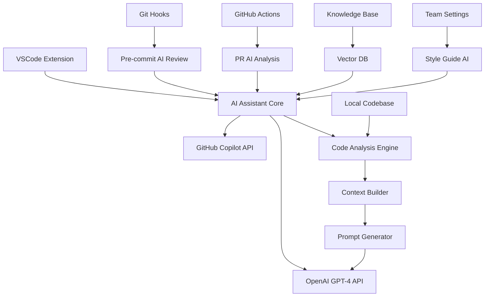

# 🤖 演習19: AI開発アシスタント構築
**難易度**: ⭐⭐⭐ 上級  
**推定時間**: 16-20時間  
**AI Engineer #9 担当**

---

## 🎯 学習目標

この演習を通じて以下のスキルを習得します：

- GitHub Copilotの高度な活用テクニック
- ChatGPT APIを使った開発支援ツールの構築
- プロンプトエンジニアリングの実践
- コード生成・レビュー・リファクタリングの自動化
- AI駆動開発ワークフローの設計
- VSCode拡張機能開発
- 自動テスト生成とカバレッジ向上

---

## 📋 要件定義

### 機能要件

#### 必須機能
1. **GitHub Copilot統合**
   - カスタムプロンプトテンプレート
   - プロジェクト固有のコード規約適用
   - コンテキスト最適化機能

2. **ChatGPT開発支援**
   - コード生成・解説・最適化
   - バグ検出と修正提案
   - リファクタリング提案
   - ドキュメント自動生成

3. **VSCode拡張機能**
   - インライン AI アシスタント
   - コードレビューパネル
   - 自動コメント生成
   - テストケース生成

4. **自動化ワークフロー**
   - コミット前AI レビュー
   - プルリクエスト自動分析
   - コード品質スコアリング
   - 学習データ蓄積

#### 推奨機能
5. **チーム開発支援**
   - コーディングスタイル統一
   - ベストプラクティス提案
   - ナレッジベース構築
   - ペアプログラミング支援

6. **パフォーマンス最適化**
   - コード効率分析
   - メモリ使用量最適化
   - パフォーマンスボトルネック検出

---

## 🎨 システム構成

### アーキテクチャ図



### 技術スタック

**フロントエンド（VSCode Extension）:**
- TypeScript
- VSCode Extension API
- Webview UI Toolkit
- Monaco Editor Integration

**バックエンド（AI サービス）:**
- Node.js / Express
- OpenAI API (GPT-4)
- GitHub Copilot API
- Vector Database (Pinecone)
- Redis (キャッシュ)

**開発ツール:**
- TypeScript
- Jest (テスト)
- ESLint / Prettier
- Webpack (バンドル)
- GitHub Actions (CI/CD)

---

## 🗂️ ファイル構成

```
05_ai_dev_assistant/
├── vscode-extension/           # VSCode拡張機能
│   ├── src/
│   │   ├── extension.ts        # メインエントリポイント
│   │   ├── commands/           # コマンド実装
│   │   ├── providers/          # プロバイダー
│   │   ├── webview/           # WebViewコンポーネント
│   │   └── utils/             # ユーティリティ
│   ├── package.json
│   └── webpack.config.js
├── ai-service/                 # AIサービスバックエンド
│   ├── src/
│   │   ├── app.ts             # Express アプリ
│   │   ├── routes/            # API ルート
│   │   ├── services/          # AI サービス
│   │   ├── prompts/           # プロンプトテンプレート
│   │   └── utils/             # ユーティリティ
│   ├── tests/
│   └── docker/
├── github-workflows/           # GitHub Actions
├── examples/                   # 使用例
├── docs/                      # ドキュメント
└── tests/                     # 統合テスト
```

---

## 🚀 実装手順

### Phase 1: VSCode拡張機能の基礎構築（4-5時間）

#### 1. VSCode拡張機能のセットアップ

**package.json設定:**
```json
{
  "name": "ai-dev-assistant",
  "displayName": "AI Development Assistant",
  "description": "GitHub Copilot & ChatGPT powered development assistant",
  "version": "1.0.0",
  "engines": {
    "vscode": "^1.74.0"
  },
  "categories": ["Other"],
  "activationEvents": [
    "onCommand:aiDevAssistant.generateCode",
    "onCommand:aiDevAssistant.reviewCode",
    "onCommand:aiDevAssistant.generateTests"
  ],
  "contributes": {
    "commands": [
      {
        "command": "aiDevAssistant.generateCode",
        "title": "Generate Code with AI",
        "category": "AI Assistant"
      },
      {
        "command": "aiDevAssistant.reviewCode",
        "title": "Review Code with AI",
        "category": "AI Assistant"
      }
    ],
    "keybindings": [
      {
        "command": "aiDevAssistant.generateCode",
        "key": "ctrl+shift+g",
        "mac": "cmd+shift+g"
      }
    ],
    "views": {
      "explorer": [
        {
          "id": "aiAssistantPanel",
          "name": "AI Assistant",
          "when": "workbenchState != empty"
        }
      ]
    }
  }
}
```

#### 2. メイン拡張機能ファイル

**src/extension.ts:**
```typescript
import * as vscode from 'vscode';
import { AIAssistantProvider } from './providers/AIAssistantProvider';
import { CodeGeneratorCommand } from './commands/CodeGeneratorCommand';
import { CodeReviewCommand } from './commands/CodeReviewCommand';

export function activate(context: vscode.ExtensionContext) {
    console.log('AI Development Assistant is now active!');

    // プロバイダー登録
    const aiProvider = new AIAssistantProvider(context);
    vscode.window.registerTreeDataProvider('aiAssistantPanel', aiProvider);

    // コマンド登録
    const generateCodeCommand = vscode.commands.registerCommand(
        'aiDevAssistant.generateCode',
        () => new CodeGeneratorCommand().execute()
    );

    const reviewCodeCommand = vscode.commands.registerCommand(
        'aiDevAssistant.reviewCode',
        () => new CodeReviewCommand().execute()
    );

    context.subscriptions.push(generateCodeCommand, reviewCodeCommand);

    // ステータスバーアイテム
    const statusBarItem = vscode.window.createStatusBarItem(
        vscode.StatusBarAlignment.Right,
        100
    );
    statusBarItem.text = "$(robot) AI Assistant";
    statusBarItem.command = 'aiDevAssistant.showPanel';
    statusBarItem.show();
    context.subscriptions.push(statusBarItem);
}

export function deactivate() {}
```

#### 3. AIアシスタントプロバイダー

**src/providers/AIAssistantProvider.ts:**
```typescript
import * as vscode from 'vscode';

export class AIAssistantProvider implements vscode.TreeDataProvider<AITask> {
    private _onDidChangeTreeData: vscode.EventEmitter<AITask | undefined | null | void> = new vscode.EventEmitter<AITask | undefined | null | void>();
    readonly onDidChangeTreeData: vscode.Event<AITask | undefined | null | void> = this._onDidChangeTreeData.event;

    constructor(private context: vscode.ExtensionContext) {}

    refresh(): void {
        this._onDidChangeTreeData.fire();
    }

    getTreeItem(element: AITask): vscode.TreeItem {
        return element;
    }

    getChildren(element?: AITask): Thenable<AITask[]> {
        if (!element) {
            return Promise.resolve([
                new AITask('Generate Code', 'Generate code using AI', vscode.TreeItemCollapsibleState.None, 'aiDevAssistant.generateCode'),
                new AITask('Review Code', 'Review selected code', vscode.TreeItemCollapsibleState.None, 'aiDevAssistant.reviewCode'),
                new AITask('Generate Tests', 'Generate unit tests', vscode.TreeItemCollapsibleState.None, 'aiDevAssistant.generateTests'),
                new AITask('Optimize Code', 'Optimize performance', vscode.TreeItemCollapsibleState.None, 'aiDevAssistant.optimizeCode')
            ]);
        }
        return Promise.resolve([]);
    }
}

class AITask extends vscode.TreeItem {
    constructor(
        public readonly label: string,
        public readonly tooltip: string,
        public readonly collapsibleState: vscode.TreeItemCollapsibleState,
        public readonly command?: string
    ) {
        super(label, collapsibleState);
        this.tooltip = tooltip;
        if (command) {
            this.command = {
                command: command,
                title: label
            };
        }
    }
}
```

### Phase 2: ChatGPT API統合とプロンプトエンジニアリング（5-6時間）

#### 4. AIサービスコア

**ai-service/src/services/ChatGPTService.ts:**
```typescript
import OpenAI from 'openai';
import { CodeContext } from '../types/CodeContext';
import { PromptTemplate } from '../prompts/PromptTemplate';

export class ChatGPTService {
    private openai: OpenAI;
    private promptTemplate: PromptTemplate;

    constructor() {
        this.openai = new OpenAI({
            apiKey: process.env.OPENAI_API_KEY
        });
        this.promptTemplate = new PromptTemplate();
    }

    async generateCode(request: CodeGenerationRequest): Promise<CodeGenerationResponse> {
        try {
            const context = await this.buildContext(request);
            const prompt = this.promptTemplate.buildCodeGenerationPrompt(context);

            const completion = await this.openai.chat.completions.create({
                model: 'gpt-4-turbo-preview',
                messages: [
                    {
                        role: 'system',
                        content: this.promptTemplate.getSystemPrompt('code_generation')
                    },
                    {
                        role: 'user',
                        content: prompt
                    }
                ],
                temperature: 0.3,
                max_tokens: 2000,
                stream: false
            });

            return {
                code: this.extractCode(completion.choices[0].message.content || ''),
                explanation: this.extractExplanation(completion.choices[0].message.content || ''),
                suggestions: await this.generateSuggestions(context),
                tokens_used: completion.usage?.total_tokens || 0
            };
        } catch (error) {
            throw new Error(`Code generation failed: ${error.message}`);
        }
    }

    async reviewCode(codeToReview: string, context: CodeContext): Promise<CodeReviewResponse> {
        const prompt = this.promptTemplate.buildCodeReviewPrompt(codeToReview, context);

        const completion = await this.openai.chat.completions.create({
            model: 'gpt-4-turbo-preview',
            messages: [
                {
                    role: 'system',
                    content: this.promptTemplate.getSystemPrompt('code_review')
                },
                {
                    role: 'user',
                    content: prompt
                }
            ],
            temperature: 0.2,
            max_tokens: 1500
        });

        return this.parseReviewResponse(completion.choices[0].message.content || '');
    }

    async generateTests(sourceCode: string, context: CodeContext): Promise<TestGenerationResponse> {
        const prompt = this.promptTemplate.buildTestGenerationPrompt(sourceCode, context);

        const completion = await this.openai.chat.completions.create({
            model: 'gpt-4-turbo-preview',
            messages: [
                {
                    role: 'system',
                    content: this.promptTemplate.getSystemPrompt('test_generation')
                },
                {
                    role: 'user',
                    content: prompt
                }
            ],
            temperature: 0.4,
            max_tokens: 2000
        });

        return {
            testCode: this.extractTestCode(completion.choices[0].message.content || ''),
            testCases: this.extractTestCases(completion.choices[0].message.content || ''),
            coverage: this.estimateCoverage(sourceCode, completion.choices[0].message.content || '')
        };
    }

    private async buildContext(request: CodeGenerationRequest): Promise<CodeContext> {
        return {
            fileName: request.fileName,
            language: request.language,
            projectType: await this.detectProjectType(),
            dependencies: await this.getDependencies(),
            codeStyle: await this.getCodeStyle(),
            existingCode: request.existingCode,
            requirements: request.requirements
        };
    }

    private extractCode(response: string): string {
        const codeMatch = response.match(/```[\w]*\n([\s\S]*?)\n```/);
        return codeMatch ? codeMatch[1] : response;
    }

    private extractExplanation(response: string): string {
        const parts = response.split('```');
        return parts.length > 2 ? parts[2].trim() : '';
    }
}

interface CodeGenerationRequest {
    fileName: string;
    language: string;
    requirements: string;
    existingCode?: string;
}

interface CodeGenerationResponse {
    code: string;
    explanation: string;
    suggestions: string[];
    tokens_used: number;
}

interface CodeReviewResponse {
    issues: CodeIssue[];
    suggestions: string[];
    score: number;
    summary: string;
}

interface TestGenerationResponse {
    testCode: string;
    testCases: TestCase[];
    coverage: number;
}
```

#### 5. プロンプトテンプレートシステム

**ai-service/src/prompts/PromptTemplate.ts:**
```typescript
export class PromptTemplate {
    private systemPrompts: Map<string, string> = new Map();

    constructor() {
        this.initializeSystemPrompts();
    }

    private initializeSystemPrompts() {
        this.systemPrompts.set('code_generation', `
あなたは熟練したソフトウェア開発者です。以下の原則に従ってコードを生成してください：

1. **コード品質**:
   - 読みやすく保守性の高いコードを書く
   - 適切な命名規則を使用する
   - 必要に応じてコメントを追加する

2. **ベストプラクティス**:
   - 言語固有のベストプラクティスを適用する
   - セキュリティを考慮した実装をする
   - パフォーマンスを意識したコードを書く

3. **エラーハンドリング**:
   - 適切なエラーハンドリングを実装する
   - エッジケースを考慮する

4. **テスタビリティ**:
   - テストしやすい構造にする
   - 依存関係の注入を考慮する

コード生成後は、実装の説明と改善提案も提供してください。
        `);

        this.systemPrompts.set('code_review', `
あなたは経験豊富なコードレビューアです。以下の観点でコードをレビューしてください：

1. **機能性**: コードが仕様通りに動作するか
2. **可読性**: コードが理解しやすいか
3. **保守性**: 将来の変更に対応しやすいか
4. **パフォーマンス**: 効率的な実装になっているか
5. **セキュリティ**: セキュリティホールがないか
6. **テスト**: テスタビリティが考慮されているか

問題があれば具体的な修正提案を、良い点があれば評価を示してください。
最後に0-100のスコアで総合評価をしてください。
        `);

        this.systemPrompts.set('test_generation', `
あなたはテスト駆動開発の専門家です。以下の原則に従ってテストコードを生成してください：

1. **網羅性**: 主要な機能と境界値をテストする
2. **独立性**: 各テストが独立して実行できる
3. **明確性**: テストの意図が明確である
4. **保守性**: 変更に強いテストコードを書く

生成するテスト：
- ユニットテスト
- 統合テスト（必要に応じて）
- エッジケースのテスト
- エラーケースのテスト

使用するテストフレームワークは、プロジェクトの設定に合わせてください。
        `);
    }

    getSystemPrompt(type: string): string {
        return this.systemPrompts.get(type) || '';
    }

    buildCodeGenerationPrompt(context: CodeContext): string {
        return `
プロジェクト情報:
- ファイル名: ${context.fileName}
- 言語: ${context.language}
- プロジェクトタイプ: ${context.projectType}
- 使用ライブラリ: ${context.dependencies.join(', ')}

コーディングスタイル:
${JSON.stringify(context.codeStyle, null, 2)}

既存コード:
\`\`\`${context.language}
${context.existingCode || 'なし'}
\`\`\`

要件:
${context.requirements}

上記の情報をもとに、適切なコードを生成してください。
生成したコードには説明と使用方法も含めてください。
        `;
    }

    buildCodeReviewPrompt(code: string, context: CodeContext): string {
        return `
以下のコードをレビューしてください：

ファイル: ${context.fileName} (${context.language})
プロジェクト: ${context.projectType}

\`\`\`${context.language}
${code}
\`\`\`

プロジェクトの依存関係: ${context.dependencies.join(', ')}
コーディング規約: ${JSON.stringify(context.codeStyle, null, 2)}

レビュー結果を以下の形式で提供してください：
1. 問題点とその修正提案
2. 良い点の評価
3. パフォーマンス改善の提案
4. セキュリティの懸念事項
5. 総合スコア (0-100)
        `;
    }

    buildTestGenerationPrompt(sourceCode: string, context: CodeContext): string {
        return `
以下のソースコードに対する包括的なテストコードを生成してください：

ファイル: ${context.fileName} (${context.language})

\`\`\`${context.language}
${sourceCode}
\`\`\`

テスト要件:
1. 主要機能のテスト
2. 境界値のテスト
3. エラーケースのテスト
4. モックが必要な場合はモックの使用例も含める

プロジェクトで使用されているテストフレームワーク: ${this.detectTestFramework(context)}

生成するテスト:
- ユニットテスト
- 必要に応じて統合テスト
- テストデータのセットアップ/クリーンアップ
        `;
    }

    private detectTestFramework(context: CodeContext): string {
        if (context.dependencies.includes('jest')) return 'Jest';
        if (context.dependencies.includes('vitest')) return 'Vitest';
        if (context.dependencies.includes('mocha')) return 'Mocha';
        return 'Jest (デフォルト)';
    }
}
```

### Phase 3: GitHub Copilot統合と高度な機能（4-5時間）

#### 6. GitHub Copilot連携

**vscode-extension/src/services/CopilotIntegration.ts:**
```typescript
import * as vscode from 'vscode';

export class CopilotIntegration {
    private copilotAPI: any;

    constructor() {
        this.initializeCopilotAPI();
    }

    private async initializeCopilotAPI() {
        // GitHub Copilot拡張機能との連携
        const copilotExtension = vscode.extensions.getExtension('GitHub.copilot');
        if (copilotExtension) {
            await copilotExtension.activate();
            this.copilotAPI = copilotExtension.exports;
        }
    }

    async enhanceWithCustomPrompts(document: vscode.TextDocument, position: vscode.Position): Promise<string[]> {
        const context = await this.buildEnhancedContext(document, position);
        const customPrompts = this.generateCustomPrompts(context);
        
        // Copilotに追加コンテキストを提供
        return this.requestCompletionsWithContext(customPrompts);
    }

    private async buildEnhancedContext(document: vscode.TextDocument, position: vscode.Position): Promise<EnhancedContext> {
        const projectInfo = await this.analyzeProject();
        const codeContext = this.analyzeCurrentCode(document, position);
        const teamStandards = await this.getTeamStandards();

        return {
            project: projectInfo,
            code: codeContext,
            standards: teamStandards,
            position: position
        };
    }

    private generateCustomPrompts(context: EnhancedContext): string[] {
        const prompts = [];

        // プロジェクト固有のプロンプト
        prompts.push(`
// Project: ${context.project.name} (${context.project.type})
// Framework: ${context.project.framework}
// Style Guide: ${context.standards.styleguide}
// Current file: ${context.code.fileName}
        `);

        // コンテキスト固有のプロンプト
        if (context.code.isTestFile) {
            prompts.push(`
// Generate comprehensive test cases following ${context.standards.testFramework} patterns
// Include edge cases, error handling, and mock data setup
            `);
        }

        if (context.code.isAPIRoute) {
            prompts.push(`
// Implement RESTful API endpoint with proper error handling
// Include input validation, authentication, and OpenAPI documentation
            `);
        }

        return prompts;
    }

    async requestCompletionsWithContext(prompts: string[]): Promise<string[]> {
        // カスタムプロンプトを使用してCopilotから候補を取得
        try {
            const completions = await this.copilotAPI.getCompletions({
                prompt: prompts.join('\n'),
                language: 'typescript',
                maxCompletions: 5
            });

            return completions.map((completion: any) => completion.text);
        } catch (error) {
            console.error('Copilot integration error:', error);
            return [];
        }
    }

    async generateProjectSpecificSnippets(): Promise<vscode.CodeAction[]> {
        const workspaceFolder = vscode.workspace.workspaceFolders?.[0];
        if (!workspaceFolder) return [];

        const projectAnalysis = await this.analyzeProjectStructure(workspaceFolder.uri.fsPath);
        const snippets = this.createContextualSnippets(projectAnalysis);

        return snippets.map(snippet => {
            const action = new vscode.CodeAction(snippet.title, vscode.CodeActionKind.Refactor);
            action.edit = new vscode.WorkspaceEdit();
            // スニペットの実装...
            return action;
        });
    }

    private async analyzeProjectStructure(projectPath: string): Promise<ProjectAnalysis> {
        // プロジェクト構造の分析
        return {
            framework: this.detectFramework(projectPath),
            architecture: this.detectArchitecture(projectPath),
            patterns: this.detectPatterns(projectPath),
            dependencies: await this.getDependencies(projectPath)
        };
    }

    private createContextualSnippets(analysis: ProjectAnalysis): ContextualSnippet[] {
        const snippets: ContextualSnippet[] = [];

        // フレームワーク固有のスニペット
        if (analysis.framework === 'React') {
            snippets.push({
                title: 'Generate React Component with TypeScript',
                template: this.getReactComponentTemplate(analysis),
                description: 'Create a new React component following project conventions'
            });
        }

        if (analysis.framework === 'Express') {
            snippets.push({
                title: 'Generate Express Route Handler',
                template: this.getExpressRouteTemplate(analysis),
                description: 'Create Express route with validation and error handling'
            });
        }

        return snippets;
    }
}

interface EnhancedContext {
    project: ProjectInfo;
    code: CodeContext;
    standards: TeamStandards;
    position: vscode.Position;
}

interface ProjectInfo {
    name: string;
    type: string;
    framework: string;
}

interface TeamStandards {
    styleguide: string;
    testFramework: string;
    lintingRules: string[];
}

interface ProjectAnalysis {
    framework: string;
    architecture: string;
    patterns: string[];
    dependencies: string[];
}

interface ContextualSnippet {
    title: string;
    template: string;
    description: string;
}
```

#### 7. 自動化ワークフローとGitHooks

**github-workflows/ai-code-review.yml:**
```yaml
name: AI Code Review

on:
  pull_request:
    types: [opened, synchronize]

jobs:
  ai-review:
    runs-on: ubuntu-latest
    
    steps:
    - name: Checkout code
      uses: actions/checkout@v4
      with:
        fetch-depth: 0

    - name: Setup Node.js
      uses: actions/setup-node@v4
      with:
        node-version: '18'
        cache: 'npm'

    - name: Install dependencies
      run: |
        cd ai-service
        npm ci

    - name: Run AI Code Review
      env:
        OPENAI_API_KEY: ${{ secrets.OPENAI_API_KEY }}
        GITHUB_TOKEN: ${{ secrets.GITHUB_TOKEN }}
      run: |
        node ai-service/scripts/ai-review.js
      
    - name: Comment PR with AI Review
      uses: actions/github-script@v7
      with:
        script: |
          const fs = require('fs');
          const reviewResults = JSON.parse(fs.readFileSync('ai-review-results.json', 'utf8'));
          
          const comment = `## 🤖 AI Code Review Results
          
          **Overall Score:** ${reviewResults.overallScore}/100
          
          ### 📋 Summary
          ${reviewResults.summary}
          
          ### 🔍 Issues Found
          ${reviewResults.issues.map(issue => `
          - **${issue.severity}**: ${issue.message}
            - File: \`${issue.file}:${issue.line}\`
            - Suggestion: ${issue.suggestion}
          `).join('\n')}
          
          ### ✅ Recommendations
          ${reviewResults.recommendations.map(rec => `- ${rec}`).join('\n')}
          
          ### 🚀 Performance Suggestions
          ${reviewResults.performanceSuggestions.map(perf => `- ${perf}`).join('\n')}
          `;
          
          github.rest.issues.createComment({
            issue_number: context.issue.number,
            owner: context.repo.owner,
            repo: context.repo.repo,
            body: comment
          });
```

**ai-service/scripts/ai-review.js:**
```javascript
const { execSync } = require('child_process');
const fs = require('fs');
const OpenAI = require('openai');

class AICodeReviewer {
    constructor() {
        this.openai = new OpenAI({
            apiKey: process.env.OPENAI_API_KEY
        });
    }

    async reviewPR() {
        try {
            // Git diff を取得
            const changedFiles = this.getChangedFiles();
            const reviewResults = [];

            for (const file of changedFiles) {
                if (this.shouldReviewFile(file)) {
                    const diff = this.getFileDiff(file);
                    const review = await this.reviewFile(file, diff);
                    reviewResults.push({ file, ...review });
                }
            }

            const overallReview = await this.generateOverallReview(reviewResults);
            
            // 結果をファイルに保存
            fs.writeFileSync('ai-review-results.json', JSON.stringify(overallReview, null, 2));
            
            return overallReview;
        } catch (error) {
            console.error('AI Review failed:', error);
            process.exit(1);
        }
    }

    getChangedFiles() {
        const output = execSync('git diff --name-only HEAD~1 HEAD', { encoding: 'utf8' });
        return output.trim().split('\n').filter(file => file.length > 0);
    }

    shouldReviewFile(fileName) {
        const reviewableExtensions = ['.ts', '.js', '.tsx', '.jsx', '.py', '.java', '.go'];
        return reviewableExtensions.some(ext => fileName.endsWith(ext));
    }

    getFileDiff(fileName) {
        try {
            return execSync(`git diff HEAD~1 HEAD -- "${fileName}"`, { encoding: 'utf8' });
        } catch (error) {
            return '';
        }
    }

    async reviewFile(fileName, diff) {
        const prompt = `
以下のファイルの変更をレビューしてください：

ファイル: ${fileName}

変更内容:
\`\`\`diff
${diff}
\`\`\`

以下の観点でレビューしてください：
1. コードの品質と可読性
2. セキュリティの問題
3. パフォーマンスの影響
4. ベストプラクティスの遵守
5. 潜在的なバグ

JSON形式で回答してください：
{
  "score": 85,
  "issues": [
    {
      "severity": "medium",
      "line": 42,
      "message": "問題の説明",
      "suggestion": "修正提案"
    }
  ],
  "positives": ["良い点1", "良い点2"],
  "suggestions": ["改善提案1", "改善提案2"]
}
        `;

        const completion = await this.openai.chat.completions.create({
            model: 'gpt-4-turbo-preview',
            messages: [{ role: 'user', content: prompt }],
            temperature: 0.3
        });

        try {
            return JSON.parse(completion.choices[0].message.content);
        } catch (error) {
            return { score: 0, issues: [], positives: [], suggestions: [] };
        }
    }

    async generateOverallReview(fileReviews) {
        const overallScore = Math.round(
            fileReviews.reduce((sum, review) => sum + review.score, 0) / fileReviews.length
        );

        const allIssues = fileReviews.flatMap(review => 
            review.issues.map(issue => ({ ...issue, file: review.file }))
        );

        const summary = await this.generateSummary(fileReviews);
        
        return {
            overallScore,
            summary,
            issues: allIssues,
            recommendations: this.generateRecommendations(fileReviews),
            performanceSuggestions: this.generatePerformanceSuggestions(fileReviews)
        };
    }

    async generateSummary(reviews) {
        const prompt = `
以下のコードレビュー結果を元に、プルリクエスト全体の要約を作成してください：

${JSON.stringify(reviews, null, 2)}

簡潔で建設的な要約を日本語で提供してください。
        `;

        const completion = await this.openai.chat.completions.create({
            model: 'gpt-4-turbo-preview',
            messages: [{ role: 'user', content: prompt }],
            temperature: 0.5,
            max_tokens: 500
        });

        return completion.choices[0].message.content;
    }

    generateRecommendations(reviews) {
        const allSuggestions = reviews.flatMap(review => review.suggestions);
        return [...new Set(allSuggestions)]; // 重複除去
    }

    generatePerformanceSuggestions(reviews) {
        const performanceKeywords = ['performance', 'optimization', 'memory', 'speed', 'cache'];
        return reviews.flatMap(review => 
            review.suggestions.filter(suggestion => 
                performanceKeywords.some(keyword => 
                    suggestion.toLowerCase().includes(keyword)
                )
            )
        );
    }
}

// メイン実行
(async () => {
    const reviewer = new AICodeReviewer();
    await reviewer.reviewPR();
})();
```

### Phase 4: ナレッジベースとチーム統合（3-4時間）

#### 8. チーム設定とスタイルガイド統合

**ai-service/src/services/TeamConfigService.ts:**
```typescript
import { readFileSync, existsSync } from 'fs';
import { join } from 'path';

export class TeamConfigService {
    private config: TeamConfig;

    constructor(projectPath: string) {
        this.config = this.loadTeamConfig(projectPath);
    }

    private loadTeamConfig(projectPath: string): TeamConfig {
        const configPath = join(projectPath, '.ai-assistant-config.json');
        
        if (existsSync(configPath)) {
            return JSON.parse(readFileSync(configPath, 'utf8'));
        }

        return this.getDefaultConfig();
    }

    private getDefaultConfig(): TeamConfig {
        return {
            codingStandards: {
                indentation: 'spaces',
                indentSize: 2,
                maxLineLength: 100,
                requireTypeAnnotations: true,
                preferConst: true
            },
            namingConventions: {
                variables: 'camelCase',
                functions: 'camelCase',
                classes: 'PascalCase',
                constants: 'UPPER_SNAKE_CASE',
                files: 'kebab-case'
            },
            frameworks: {
                frontend: 'React',
                backend: 'Express',
                testing: 'Jest',
                styling: 'Tailwind'
            },
            codeReviewGuidelines: [
                'すべての関数にJSDocコメントを追加する',
                'エラーハンドリングを適切に実装する',
                'テストカバレッジ80%以上を維持する',
                'セキュリティベストプラクティスに従う'
            ],
            aiPromptCustomizations: {
                codeGeneration: {
                    includeDocumentation: true,
                    includeErrorHandling: true,
                    includeTypeAnnotations: true,
                    preferFunctionalStyle: true
                },
                codeReview: {
                    strictnessLevel: 'medium',
                    focusAreas: ['security', 'performance', 'maintainability'],
                    customRules: []
                }
            }
        };
    }

    getCodeGenerationPromptEnhancement(): string {
        const { codingStandards, namingConventions, frameworks } = this.config;
        
        return `
チームのコーディング規約に従ってコードを生成してください：

コーディングスタンダード:
- インデント: ${codingStandards.indentation} (${codingStandards.indentSize}文字)
- 最大行長: ${codingStandards.maxLineLength}文字
- 型注釈: ${codingStandards.requireTypeAnnotations ? '必須' : 'オプション'}

命名規則:
- 変数: ${namingConventions.variables}
- 関数: ${namingConventions.functions}
- クラス: ${namingConventions.classes}
- 定数: ${namingConventions.constants}

使用フレームワーク:
- フロントエンド: ${frameworks.frontend}
- バックエンド: ${frameworks.backend}
- テスト: ${frameworks.testing}

追加要件:
${this.config.codeReviewGuidelines.map(rule => `- ${rule}`).join('\n')}
        `;
    }

    getCodeReviewPromptEnhancement(): string {
        const { aiPromptCustomizations } = this.config;
        const reviewConfig = aiPromptCustomizations.codeReview;
        
        return `
チーム固有のレビュー基準でコードを評価してください：

厳格度: ${reviewConfig.strictnessLevel}
重点分野: ${reviewConfig.focusAreas.join(', ')}

チームルール:
${this.config.codeReviewGuidelines.map(rule => `- ${rule}`).join('\n')}

カスタムルール:
${reviewConfig.customRules.map(rule => `- ${rule}`).join('\n')}
        `;
    }

    updateConfig(updates: Partial<TeamConfig>): void {
        this.config = { ...this.config, ...updates };
        // 設定をファイルに保存
        this.saveConfig();
    }

    private saveConfig(): void {
        // 設定保存の実装
    }
}

interface TeamConfig {
    codingStandards: CodingStandards;
    namingConventions: NamingConventions;
    frameworks: Frameworks;
    codeReviewGuidelines: string[];
    aiPromptCustomizations: AIPromptCustomizations;
}

interface CodingStandards {
    indentation: 'spaces' | 'tabs';
    indentSize: number;
    maxLineLength: number;
    requireTypeAnnotations: boolean;
    preferConst: boolean;
}

interface NamingConventions {
    variables: string;
    functions: string;
    classes: string;
    constants: string;
    files: string;
}

interface Frameworks {
    frontend: string;
    backend: string;
    testing: string;
    styling: string;
}

interface AIPromptCustomizations {
    codeGeneration: {
        includeDocumentation: boolean;
        includeErrorHandling: boolean;
        includeTypeAnnotations: boolean;
        preferFunctionalStyle: boolean;
    };
    codeReview: {
        strictnessLevel: 'low' | 'medium' | 'high';
        focusAreas: string[];
        customRules: string[];
    };
}
```

---

## ✅ チェックリスト

### 基本機能チェック
- [ ] VSCode拡張機能が正常にインストール・動作する
- [ ] ChatGPT APIとの連携が正常に動作する
- [ ] GitHub Copilotとの統合が機能する
- [ ] コード生成機能が適切に動作する
- [ ] コードレビュー機能が詳細な分析を提供する
- [ ] テスト生成機能が網羅的なテストを作成する

### AI統合チェック
- [ ] プロンプトエンジニアリングが効果的に機能する
- [ ] コンテキスト理解が正確である
- [ ] カスタムプロンプトテンプレートが動作する
- [ ] エラーハンドリングとフォールバック機能がある
- [ ] レスポンス時間が許容範囲内である

### 自動化機能チェック
- [ ] GitHub Actionsワークフローが動作する
- [ ] PR自動レビュー機能が正常に動作する
- [ ] チーム設定の統合が機能する
- [ ] Git Hooksが適切に動作する

### 品質チェック
- [ ] コードが型安全である
- [ ] エラーハンドリングが適切
- [ ] パフォーマンスが良好
- [ ] セキュリティが考慮されている
- [ ] テストカバレッジが十分

---

## 🎓 学習ポイント

### GitHub Copilot活用テクニック
1. **コンテキストの最適化**: プロジェクト固有の情報を効果的に提供
2. **プロンプトエンジニアリング**: Copilotが理解しやすいコメントの書き方
3. **チーム統合**: 共有設定によるコード品質の統一

### ChatGPT API最適化
1. **プロンプト設計**: システムプロンプトとユーザープロンプトの使い分け
2. **レスポンス解析**: 構造化されたレスポンスの処理
3. **コスト最適化**: トークン使用量の管理

### AI駆動開発ワークフロー
1. **継続的改善**: AI フィードバックループの設計
2. **品質保証**: 人間のレビューとAIレビューの組み合わせ
3. **学習データ**: チーム固有のナレッジベース構築

---

**🎓 AI Engineer による作成**: 2025-10-22  
**📈 難易度**: ⭐⭐⭐ 上級 | **⏱️ 推定時間**: 16-20時間