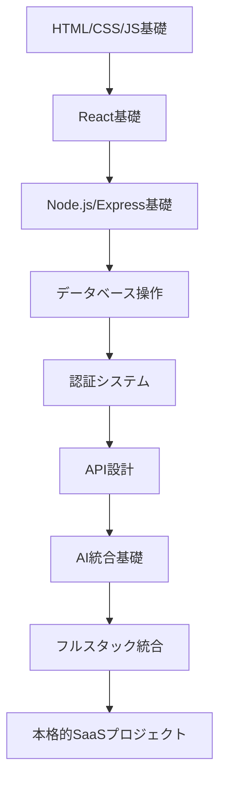

# 🎯 実践的演習問題集
**AI Education Assistant #8 + AI Engineer #9 担当領域**

**2025年最新版 - フルスタック開発の実践力を身につける段階的演習**

---

## 📋 演習概要

このディレクトリには、フルスタック開発スキルを段階的に習得するための実践的演習問題が含まれています。各演習は実際のプロジェクトを想定した実用的な内容となっています。

## 🎓 演習レベル

### 初級（Beginner）⭐
基本的なWeb開発スキルの習得

### 中級（Intermediate）⭐⭐
実務レベルの開発スキルの習得

### 上級（Advanced）⭐⭐⭐
プロダクション環境対応の高度なスキル

---

## 📚 演習一覧

### フロントエンド演習

#### ⭐ 初級演習
1. **[個人プロフィールページ](./01_beginner/01_profile_page/)**
   - HTML/CSS/JavaScript基礎
   - レスポンシブデザイン
   - フォーム操作

2. **[TODOアプリ](./01_beginner/02_todo_app/)**
   - React基礎
   - 状態管理（useState）
   - ローカルストレージ

3. **[天気予報アプリ](./01_beginner/03_weather_app/)**
   - 外部API連携
   - 非同期処理（fetch）
   - エラーハンドリング

#### ⭐⭐ 中級演習
4. **[ECサイトフロント](./02_intermediate/01_ecommerce_frontend/)**
   - 商品一覧・詳細・カート機能
   - React Router
   - 状態管理（Zustand）
   - 決済フロー（Stripe）

5. **[ブログプラットフォーム](./02_intermediate/02_blog_platform/)**
   - CRUD操作
   - 認証（JWT）
   - リッチテキストエディタ
   - 画像アップロード

6. **[リアルタイムチャット](./02_intermediate/03_realtime_chat/)**
   - WebSocket通信
   - リアルタイム更新
   - 複数ルーム対応

#### ⭐⭐⭐ 上級演習
7. **[プロジェクト管理ツール](./03_advanced/01_project_management/)**
   - 複雑な状態管理
   - ドラッグ&ドロップ
   - リアルタイムコラボレーション
   - PWA対応

8. **[ダッシュボード分析ツール](./03_advanced/02_analytics_dashboard/)**
   - データ可視化（Chart.js/D3.js）
   - 大量データ処理
   - フィルタリング・ソート
   - エクスポート機能

### バックエンド演習

#### ⭐ 初級演習
9. **[REST API基礎](./01_beginner/04_rest_api_basics/)**
   - Express.js基礎
   - CRUD操作
   - ミドルウェア
   - エラーハンドリング

10. **[ユーザー認証API](./01_beginner/05_auth_api/)**
    - ユーザー登録・ログイン
    - JWT実装
    - パスワードハッシュ化
    - 認証ミドルウェア

#### ⭐⭐ 中級演習
11. **[ECサイトバックエンド](./02_intermediate/04_ecommerce_backend/)**
    - データベース設計
    - 商品管理API
    - 注文処理API
    - 在庫管理

12. **[ファイルアップロードAPI](./02_intermediate/05_file_upload_api/)**
    - マルチパートアップロード
    - 画像リサイズ
    - クラウドストレージ（AWS S3）
    - メタデータ管理

#### ⭐⭐⭐ 上級演習
13. **[マイクロサービス構築](./03_advanced/03_microservices/)**
    - サービス分割設計
    - API Gateway
    - サービス間通信
    - 分散トランザクション

14. **[リアルタイム配信API](./03_advanced/04_streaming_api/)**
    - WebSocket実装
    - Server-Sent Events
    - 負荷分散
    - スケーリング

### AI統合演習

#### ⭐ 初級演習
15. **[AIチャットボット](./01_beginner/06_ai_chatbot/)**
    - OpenAI API基礎
    - プロンプト設計
    - レスポンス処理
    - 会話履歴管理

16. **[AI画像生成ツール](./01_beginner/07_ai_image_generator/)**
    - DALL-E API連携
    - プロンプト最適化
    - 画像保存・管理
    - UI/UX設計

#### ⭐⭐ 中級演習
17. **[AI文書要約システム](./02_intermediate/06_ai_document_summarizer/)**
    - PDF/文書解析
    - 自然言語処理
    - 要約アルゴリズム
    - 多言語対応

18. **[AI顧客サポート](./02_intermediate/07_ai_customer_support/)**
    - 意図分析
    - FAQ自動応答
    - エスカレーション機能
    - 学習データ蓄積

#### ⭐⭐⭐ 上級演習
19. **[AI開発アシスタント](./03_advanced/05_ai_dev_assistant/)**
    - コード生成・レビュー
    - GitHub Copilot統合
    - 自動テスト生成
    - リファクタリング提案

20. **[RAGシステム構築](./03_advanced/06_rag_system/)**
    - ベクトルデータベース
    - 文書埋め込み
    - 検索拡張生成
    - コンテキスト管理

### フルスタック統合演習

#### ⭐⭐⭐ 総合演習
21. **[SaaSプラットフォーム](./04_capstone/01_saas_platform/)**
    - マルチテナント設計
    - サブスクリプション管理
    - 使用量メータリング
    - API制限・課金

22. **[AI駆動ECプラットフォーム](./04_capstone/02_ai_ecommerce/)**
    - レコメンドシステム
    - 動的価格設定
    - 在庫予測
    - パーソナライゼーション

---

## 🎯 学習フロー

### 推奨学習順序



### 各演習の構成

各演習ディレクトリには以下が含まれています：

```
演習名/
├── README.md              # 演習の説明・要件
├── starter/                # スターターコード
├── solution/              # 解答例
├── tests/                 # テストコード
├── docs/                  # 設計書・参考資料
└── assets/                # 画像・データファイル
```

### 評価基準

各演習は以下の観点で評価されます：

- **機能要件**: 指定された機能が正しく動作するか
- **非機能要件**: パフォーマンス、セキュリティ、ユーザビリティ
- **コード品質**: 可読性、保守性、テスタビリティ
- **設計思想**: アーキテクチャ、設計パターンの適用

---

## 🚀 クイックスタート

### 1. 演習の選択
自分のレベルに応じて演習を選択してください。

### 2. 環境セットアップ
```bash
cd 演習ディレクトリ
npm install
cp .env.example .env
```

### 3. 要件確認
README.mdで演習の詳細要件を確認してください。

### 4. 実装開始
starterコードから実装を開始してください。

### 5. テスト実行
```bash
npm test
npm run test:e2e
```

### 6. 解答確認
実装完了後、solutionディレクトリで解答例を参照してください。

---

## 💡 学習のポイント

### コードレビューの実践
- 各演習完了後、セルフレビューを実施
- 設計判断の理由を文書化
- リファクタリングの機会を探す

### 現実的な制約を意識
- パフォーマンス制約
- セキュリティ要件
- スケーラビリティ
- 保守性

### 最新のベストプラクティス
- TypeScriptの積極的利用
- テスト駆動開発（TDD）
- CI/CDパイプライン
- セキュリティファースト設計

---

## 🔗 関連リソース

- [実装コード例](../examples/) - 参考実装
- [設計ドキュメント](../../01_docs_and_specs/) - 理論・設計指針
- [自動化ツール](../../03_tools_and_ops/) - 開発支援ツール
- [学習ジャーナル](../../99_learning_journal/) - 進捗管理

---

**🎓 AI Education Assistant + AI Engineer による作成**: 2025-10-22  
**📈 次回更新予定**: 新技術・演習追加時